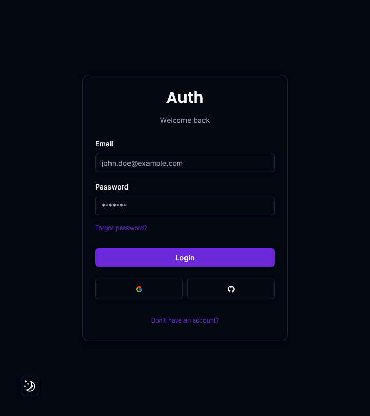

# Authentication App

This project is an authentication app implemented with [AuthJS-V5](https://authjs.dev/) and NextJS.

<div style="display: flex; height: 450px; width: 100%;">
  

</div>

## Features
- Github & Google authentication
- Credentials authentication
- Email verification
- 2 Factor Authentication using email
- Role based access control
- Update profile: Credentials (email, password, name, role, 2FA) Oauth: (name, role)
- Forgot password functionality
- Light and dark mode


## Technologies

- [NextJS](https://nextjs.org/) (App router and server actions)
- [Typescript](https://www.typescriptlang.org/)
- [AuthJS-V5](https://authjs.dev/)
- [Prisma](https://www.prisma.io/)
- [PostgreSQL](https://www.postgresql.org/)
- [React Hook Form](https://react-hook-form.com/)
- [Zod](https://github.com/colinhacks/zod)
- [Resend](https://resend.com/)
- [TailwindCSS](https://tailwindcss.com/)
- [Shadcn/ui](https://ui.shadcn.com/)


## Installation

### Pre-requisites

[NodeJS](https://nodejs.org/en)

## Run this project locally

1. Clone this repository to your local machine:

```bash
 git clone https://github.com/Matheus-OAMK/NextJS_Auth.git
```

2. Inside the root directory run the the following command:

```bash
 npm install
```

3. Setup .env file using your own variables (Read instructions on .env.example)

```js
DATABASE_URL=
DIRECT_URL=

AUTH_SECRET=

GITHUB_CLIENT_ID=
GITHUB_CLIENT_SECRET=

GOOGLE_CLIENT_ID=
GOOGLE_CLIENT_SECRET=

RESEND_API_KEY=
RESEND_EMAIL_DOMAIN=

NEXT_PUBLIC_APP_URL=
```

4. Setup database using prisma

```bash
npx prisma generate
npx prisma db push
```

5. Run the project

```bash
 npm run dev
```


